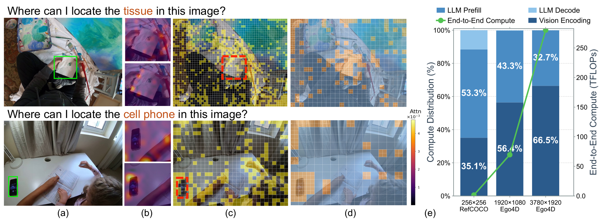
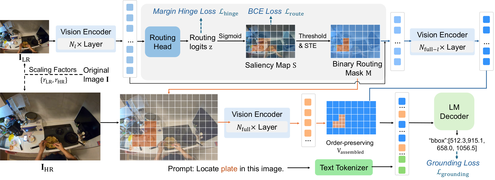
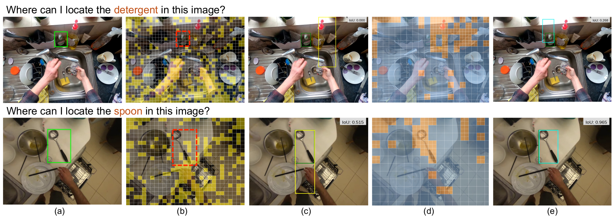

<div align="center">

## Dynamic Resolution Routing for Efficient Egocentric Grounding

[](https://arxiv.org/abs/2608.01638)
[](#installation)
[](#installation)
[](https://github.com/QwenLM/Qwen2.5-VL)
[](LICENSE)

[arXiv](https://arxiv.org/abs/2608.01638)&nbsp;&nbsp;·&nbsp;&nbsp;[Installation](#installation)&nbsp;&nbsp;·&nbsp;&nbsp;[Quick Start](#quick-start)&nbsp;&nbsp;·&nbsp;&nbsp;[Training](#training)&nbsp;&nbsp;·&nbsp;&nbsp;[Evaluation](#evaluation)

</div>

---

## Introduction

**Motivation.** Egocentric grounding localizes target objects from natural-language queries in
first-person video. Targets are often small and observed under rapid viewpoint changes, so
high-resolution inputs are essential for preserving the fine-grained details required for
perception. That makes scaling MLLMs prohibitively expensive: a 3780×1920 frame can yield 9.3k
visual tokens, and visual encoding consumes up to **66.5% of the end-to-end inference
budget**.

<p align="center"></p>

**Architecture.** SmartRes shifts efficiency optimization from **post-hoc token pruning** to
**proactive pixel-space selection**. A low-resolution branch provides spatial guidance,
enabling a lightweight router to activate high-resolution patches only in object-centric
regions.

<p align="center"></p>

## Release

- [x] **Environment**: [LLaMA-Factory fork](https://github.com/HuixinSun/LLaMA-Factory-SmartRes) with the SmartRes integration
- [x] **Training & Inference**: scripts for both, on the EgoIntention context and uncommon splits
- [x] **Checkpoint**: SmartRes-Lite
- [x] **Analysis**: per-scale accuracy and token ratio
- [x] **Comparisons**: down-scaling, FastV
- [x] **Data**: annotations at 100% and 10% → 50%, and a script for other budgets

## Installation

**Step 1. Environment and package.**

```bash
git clone --recursive https://github.com/HuixinSun/SmartRes.git && cd SmartRes
conda create -n smartres python=3.10 -y && conda activate smartres

pip install torch==2.9.1 torchvision==0.24.1 --index-url https://download.pytorch.org/whl/cu128
pip install -r env/requirements.txt
pip install -e .
```

**Step 2. Training and generation loop.** Provided by our
[LLaMA-Factory fork](https://github.com/HuixinSun/LLaMA-Factory-SmartRes), included as a
submodule:

```bash
git submodule update --init          # only if you cloned without --recursive
pip install -e third_party/LLaMA-Factory -c env/constraints.txt
```

`bash env/setup.sh smartres` runs both steps in one go.

## Quick Start

**Step 1. Unpack the checkpoint.**

```bash
sha256sum -c checkpoints/smartres-lite.tar.gz.sha256
tar -xzf checkpoints/smartres-lite.tar.gz -C checkpoints/
```

**Step 2. Install the router onto a Qwen2.5-VL model.**

```python
import torch
from PIL import Image
from peft import PeftModel
from transformers import AutoProcessor, Qwen2_5_VLForConditionalGeneration

from smartres import install_smartres
from smartres.preprocess import build_dual_resolution

model = Qwen2_5_VLForConditionalGeneration.from_pretrained(
    "Qwen/Qwen2.5-VL-3B-Instruct", torch_dtype=torch.bfloat16, device_map="cuda"
)
model = PeftModel.from_pretrained(model, "checkpoints/smartres-lite")
install_smartres(model, tau=0.5, router_layer=30, encode_snap="window")

processor = AutoProcessor.from_pretrained("Qwen/Qwen2.5-VL-3B-Instruct")
views = build_dual_resolution(Image.open("frame.jpg"), processor.image_processor, hr_scale=0.2)
```

Use the same `tau` the adapter was trained with.

## Data

**Frames.** EgoIntention uses the [Ego4D](https://ego4d-data.org/) split of
[PACO](https://github.com/facebookresearch/paco). Point the `images` field of the JSONs at
your copy.

**Labels.** Boxes are stored in the coordinate frame of the resolution they were rendered at,
so a setting names two resolutions, both as a fraction of the frame's native token budget:
the base resolution the boxes are defined in, and the target resolution the image is stored
at. `10to50` is a base resolution of 10% and a target resolution of 50%.

| Setting | Files |
|:--|:--|
| 100% | `mllm_rec_egoint.json`, `egointention_{context,uncommon}_test.json` |
| 10% → 50% (Lite) | `mllm_rec_egoint_10to50.json`, `egointention_{context,uncommon}_test_10to50.json` |

**Tools.** Build a label set at another budget with:

```bash
python tools/prepare_labels.py --input data/egointention_context_test.json \
    --output data/egointention_context_test_10to50.json \
    --image-ratio 0.5 --label-ratio 0.2 --write-images /path/to/frames_50pct
```

`--image-ratio` resizes relative to the original; `--label-ratio` picks the box coordinate
frame relative to that resized image.

## Training

```bash
bash scripts/train.sh                       # SmartRes-Lite
bash scripts/train.sh --hr-budget 1.00      # SmartRes-Pro
NPROC=4 bash scripts/train.sh               # more GPUs
```

**Configs.** Set in `configs/qwen2_5vl_3b_lora_sft_egoint_lite.yaml`; the matching flag
overrides it.

```yaml
use_smartres: true
tau: 0.5             # routing threshold, M = STE(S > tau)
router_layer: 30     # vision block the router reads
encode_snap: window  # encode-set granularity: window | unit
lr_budget: 0.10      # r_LR, low-resolution token budget
hr_budget: 0.50      # r_HR, high-resolution token budget
lambda_route: 0.01   # weight of the routing BCE term
lambda_hinge: 0.05   # weight of the margin regulariser
```

Use the same `encode_snap` for training and evaluation.

## Evaluation

```bash
bash scripts/eval.sh context     # also: uncommon
```

**Configs.** Set in `configs/qwen2_5vl_3b_lora_predict_egoint_lite.yaml`; use the same values
the checkpoint was trained with.

```yaml
use_smartres: true
tau: 0.5                        # routing threshold, M = STE(S > tau)
router_layer: 30                # vision block the router reads
encode_snap: window             # encode-set granularity: window | unit
lr_budget: 0.10                 # r_LR, low-resolution token budget
hr_budget: 0.50                 # r_HR, high-resolution token budget
per_device_eval_batch_size: 1   # must stay 1
```

**Results.** EgoIntention context split.

| | P@0.5 | P@0.3 | mIoU | P_s | P_m | P_l | Ratio |
|:--|--:|--:|--:|--:|--:|--:|--:|
| SmartRes-Lite | 52.37 | 59.29 | 0.4661 | 24.02 | 49.56 | 61.74 | 29.24% |
| full resolution | 58.74 | 63.91 | 0.5362 | 36.93 | 53.90 | 71.22 | 100% |

## Per-scale Accuracy

Objects are defined by relative box area `S` into small (`S<0.005`), medium
(`0.005≤S<0.05`) and large (`S≥0.05`), reported as P_s, P_m and P_l:

```bash
python tools/score_per_scale.py \
    --predictions outputs/eval_context/generated_predictions.jsonl \
    --dataset data/egointention_context_test_10to50.json
```

## Token Ratio

**1. Record.** Set `SMARTRES_TOKEN_LOG=1`, which makes the vision tower print one keyed line
per forward:

```bash
SMARTRES_TOKEN_LOG=1 bash scripts/eval.sh context
```

**2. Score.** Point the tool at the log. It pulls the records out, writes them to
`--extract`, and reports:

```bash
python tools/score_token_ratio.py \
    --log outputs/eval_context/run.log --extract outputs/eval_context/tokens.txt \
    --full-dataset data/egointention_context_test.json \
    --high-res-dataset data/egointention_context_test_10to50.json
```

## Comparisons

```bash
python comparisons/downscale.py --input data/egointention_context_test.json \
    --output data/egointention_context_test_32pct.json --ratio 0.32
```

<p align="center"></p>

**Qualitative comparison.** FastV's **(b)** pruning mask and **(c)** prediction against
SmartRes' **(d)** routing mask and **(e)** prediction, with IoU on each.

## Citation

```bibtex
@article{sun2026smartres,
  title   = {Dynamic Resolution Routing for Efficient Egocentric Grounding},
  author  = {Sun, Huixin and Zhao, Wangbo and Wei, Fanyue and Lin, Qiuxia and
             Sun, Pengzhan and Yao, Angela},
  journal = {arXiv preprint arXiv:2608.01638},
  year    = {2026}
}
```

## Acknowledgements

Built on [Qwen2.5-VL](https://github.com/QwenLM/Qwen2.5-VL) and
[LLaMA-Factory](https://github.com/hiyouga/LLaMA-Factory).

Data comes from [EgoIntention](https://github.com/pengzhansun/EgoIntention), built on
[PACO](https://github.com/facebookresearch/paco) over [Ego4D](https://ego4d-data.org/) frames.

## License

Apache 2.0. See [LICENSE](LICENSE).
